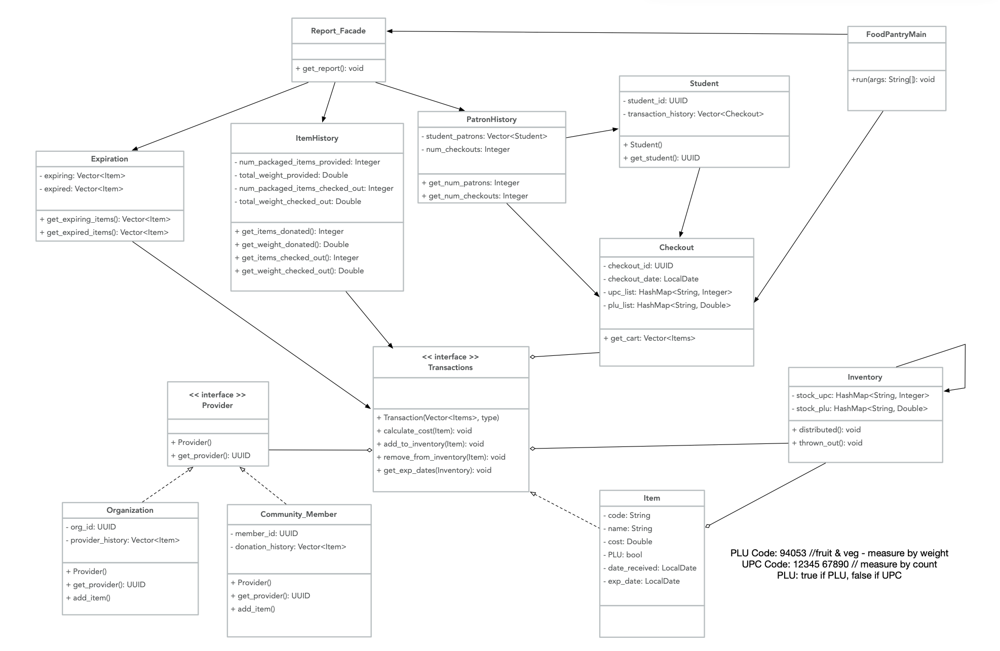

# Food Pantry - Java (Spring)

## Maintenance Project
Shelley Wong, Nomaan Faiyaz Shaikh, Pratiksha Kapse

## Continuous Integration status
[](https://travis-ci.com/shelleywong/PantrySpring)

## FoodPantry UML Diagram (last updated 2020-04-21)


### Running the example

Use `mvn package` to compile the Java code, run any tests, and package the code in a JAR file within a target directory. Then use the following `java` command to run the program. In [pom.xml](pom.xml), we have designated pantry.Client as the `mainClass` for this program.

```{bash}
$ mvn package
$ java -jar target/gs-maven-0.1.0.jar
```
