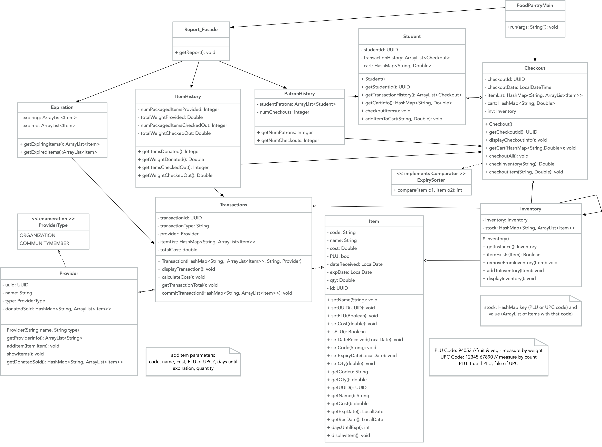

# Food Pantry - Java (Spring)

## Maintenance Project
Shelley Wong, Nomaan Faiyaz Shaikh, Pratiksha Kapse

## Continuous Integration status
[](https://travis-ci.com/shelleywong/PantrySpring)
[](https://sonarcloud.io/dashboard?id=shelleywong_PantrySpring)

## FoodPantry UML Diagram (last updated 2020-05-02)


### Before You Start

To build you will need [Git](https://help.github.com/en/github/getting-started-with-github/set-up-git) and [JDK 8 update 60 or later](https://www.oracle.com/java/technologies/javase-downloads.html). Be sure that your `JAVA_HOME` environment variable points to the `jdk1.8.0` folder extracted from the JDK download.

### Get the Source

On GitHub, fork `PantrySpring` and then clone from your personal repo using `git clone `. Then `cd PantrySpring` to start working in the `PantrySpring` directory.

### Running the program

Use `mvn package` to compile the Java code, run any tests, and package the code in a JAR file within a target directory. Then use the following `java` command to run the program. In [pom.xml](pom.xml), we have designated `main.java.pantry.Client` as the `mainClass` for this program.

```{bash}
$ mvn package
$ java -jar target/PantrySpring-0.1.0.jar
```

### Import into your IDE

Ensure JDK 8 is configured properly in the IDE. Follow instructions for [Eclipse](https://github.com/spring-projects/spring-framework/blob/master/import-into-eclipse.md) and [IntelliJ IDEA](https://github.com/spring-projects/spring-framework/blob/master/import-into-idea.md).
