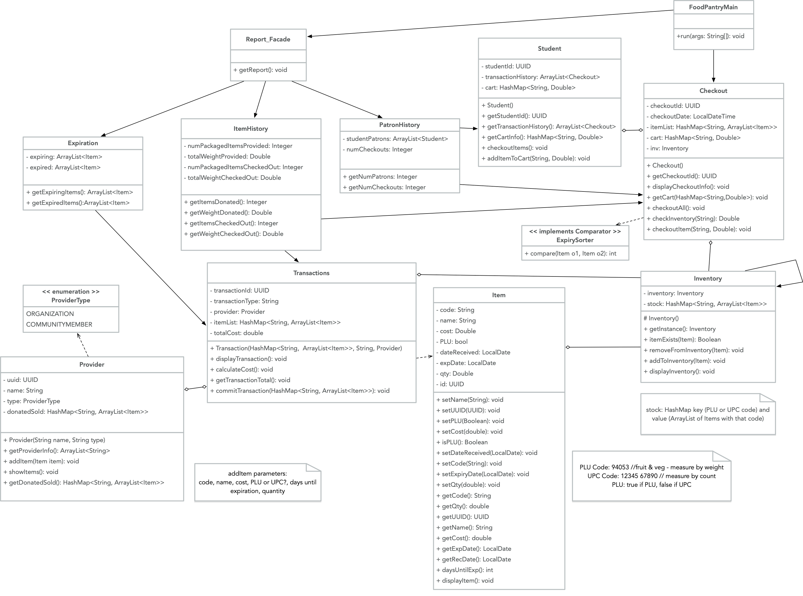

# Contributing to the Spring Pantry

First off, this is a project built on the Spring Framework, and the guidelines for contributing to this repository are based on the same [contributing guidelines](https://github.com/spring-projects/spring-framework/blob/master/CODE_OF_CONDUCT.adoc) used by the Spring Framework. Thank you for taking the time to contribute! :+1: :tada:

### Table of Contents

* [Code of Conduct](#code-of-conduct)
* [How to Contribute](#how-to-contribute)
  * [Discuss](#discuss)
  * [Design](#design)
  * [Create an Issue](#create-an-issue)
  * [Issue Lifecycle](#issue-lifecycle)
  * [Submit a Pull Request](#submit-a-pull-request)
* [Build from Source](#build-from-source)
* [Source Code Style](#source-code-style)

### Code of Conduct

This project is governed by the official [Spring Code of Conduct](https://github.com/spring-projects/spring-framework/blob/master/CODE_OF_CONDUCT.adoc).
By participating you are expected to uphold this code.

### How to Contribute

#### Discuss

If you have a question about the Spring Framework, check Stack Overflow using [this list of tags](https://stackoverflow.com/questions/tagged/spring+or+spring-mvc+or+spring-aop+or+spring-jdbc+or+spring-transactions+or+spring-annotations+or+spring-jms+or+spring-el+or+spring-test+or+spring+or+spring-remoting+or+spring-orm+or+spring-jmx+or+spring-cache+or+spring-webflux?tab=Newest). Find an existing discussion, or start a new one if necessary. Reading those discussions helps you to learn about the issue, and helps us to make a decision.

#### Design

We've created a UML diagram to visually document the design of the system (see below). To improve maintainability, we have strived to follow Java best practices and good software design pattern principles in general. The `Inventory` is a singleton to ensure there is only one instance of the inventory and that what is in stock is in fact available. The reports are set up as a `ReportFacade`, so clients have a unified interface to view all of the details provided in the report. The `Provider` class is easily extensible to different types of providers, via the use of an enumeration to determine `ProviderType`. There can be many instances of `Provider`, `Student`, and `Item`, so each of these classes is built with high cohesion and low software complexity in mind. The `Provider` is separate from the `Transactions` adding items to the inventory, and the `Student` is separate from the `Checkout` removing items from the inventory. Students and Providers do not have to worry about the details for ensuring that transactions and checkouts run smoothly (e.g. making sure an item exists before removing it), since these issues are handled in their own respective classes.

#### FoodPantry UML Diagram (last updated 2020-05-02)

#### Create an Issue

Reporting an issue or making a feature request is a great way to contribute. Your feedback (and the conversations that result from it) provide a continuous flow of ideas. However, before creating a ticket, please take the time to [discuss and research](#discuss) first.

If creating an issue after a discussion on Stack Overflow, please provide a description in the issue instead of simply referring to Stack Overflow. The issue tracker is an important place of record for design discussions and should be self-sufficient.

Once you're ready, create an issue on [GitHub](https://github.com/ChicoState/PantrySpring/issues).

#### Issue Lifecycle

When an issue is first created, it is flagged `waiting for triage` waiting for a team member to triage it. Once the issue has been reviewed, the team may ask for further information if needed, and based on the findings, the issue is either assigned a target milestone or is closed with a specific status.

When a fix is ready, the issue is closed and may still be re-opened until the fix is released. After that the issue will typically no longer be reopened. In rare cases if the issue was not at all fixed, the issue may be re-opened. In most cases however any follow-up reports will need to be created as new issues with a fresh description.

#### Submit a Pull Request

1. Should you create an issue first? No, just create the pull request and use the description to provide context and motivation, as you would for an issue. If you want to start a discussion first or have already created an issue, once a pull request is created, we will close the issue as superseded by the pull request, and the discussion about the issue will continue under the pull request.

2. Always check out the `master` branch and submit pull requests against it (for target version and configuration details, see [pom.xml](https://github.com/ChicoState/PantrySpring/blob/master/pom.xml)). Backports to prior versions will be considered on a case-by-case basis and reflected as the fix version in the issue tracker.

3. Choose the granularity of your commits consciously and squash commits that represent multiple edits or corrections of the same logical change. See [Rewriting History section of Pro Git](https://git-scm.com/book/en/Git-Tools-Rewriting-History) for an overview of streamlining the commit history.

4. Format commit messages using 55 characters for the subject line, 72 characters per line for the description, followed by the issue fixed, e.g. `Closes gh-22276`. See the [Commit Guidelines section of Pro Git](https://git-scm.com/book/en/Distributed-Git-Contributing-to-a-Project#Commit-Guidelines) for best practices around commit messages, and use `git log` to see some examples.

5. If there is a prior issue, reference the GitHub issue number in the description of the pull request.

If accepted, your contribution may be heavily modified as needed prior to merging. You will likely retain author attribution for your Git commits granted that the bulk of your changes remain intact. You may also be asked to rework the submission.

If asked to make corrections, simply push the changes against the same branch, and your pull request will be updated. In other words, you do not need to create a new pull request when asked to make changes.

#### Participate in Reviews

Helping to review pull requests is another great way to contribute. Your feedback can help to shape the implementation of new features. When reviewing pull requests, however, please refrain from approving or rejecting a PR unless you are a core committer for the Spring Pantry.

### Build from Source

See the [README](https://github.com/ChicoState/PantrySpring/blob/master/README.md) for instructions on how to check out, build, and import the Spring Pantry source code into your IDE.

### Source Code Style

The wiki pages for the Spring Framework [Code Style](https://github.com/spring-projects/spring-framework/wiki/Code-Style) and [IntelliJ IDEA Editor Settings](https://github.com/spring-projects/spring-framework/wiki/IntelliJ-IDEA-Editor-Settings) define the source file coding standards we use along with some IDEA editor settings we customize.
